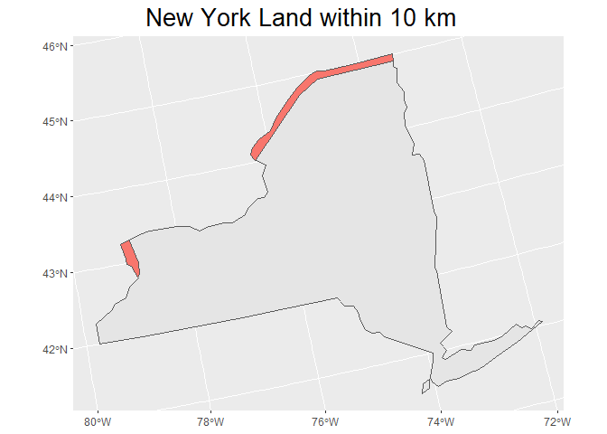

Case Study 05
================
Zixuan Chen
Sep. 28, 2020

## Load the Packages

``` r
library(spData)
library(sf)
library(tidyverse)
```

## Import the Data

``` r
data(world)
data(us_states)
```

## Set Up the CRS

``` r
albers="+proj=aea +lat_1=29.5 +lat_2=45.5 +lat_0=37.5 +lon_0=-96 +x_0=0 +y_0=0 +ellps=GRS80 +datum=NAD83 +units=m +no_defs"
```

## Filter the Data

``` r
Canada = world %>%
  filter(name_long == "Canada")%>%
  st_transform(Canada, crs = albers )
can_bu = st_buffer(Canada, 10000)

New_york = us_states%>%
  filter(NAME == "New York")%>%
  st_transform(New_york, crs = albers )

border = st_intersection(can_bu,New_york)
```

## Plot and Area Calculation

``` r
p1 = ggplot(New_york)+
  geom_sf()+
  geom_sf(data = border, aes(fill = "red"))+
  labs(title = "New York Land within 10 km")+
  theme(legend.position = "none",
        plot.title = element_text(size = 20,
                                  hjust = 0.4))
print(p1)
```

<!-- -->

``` r
area_border = units::set_units(st_area(border),km^2)
print(area_border)
```

    ## 3495.19 [km^2]
